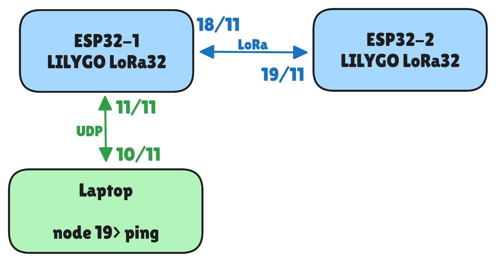

# ESP CSP LoRa

This is an example project for getting libcsp running on the ESP32 and
utilizing LoRa technology. The code is designed to run on the LoRa32 V2.1_1.6,
and it uses the driver for the LoRa chip found at
[nopnop2002/esp-idf-sx127x](https://github.com/nopnop2002/esp-idf-sx127x).

Inside this repository, you can find the CSP source code at
[libcsp/libcsp](https://github.com/libcsp/libcsp), along with the necessary
code to enable CSP to utilize the LoRa chip on the board.

The current capabilities of this project are illustrated in the figure above.
The setup consists of two Lilligo LoRa boards. One of the boards can serve as a
UDP bridge, allowing communication with the other LoRa board through UDP ->
LoRa.

